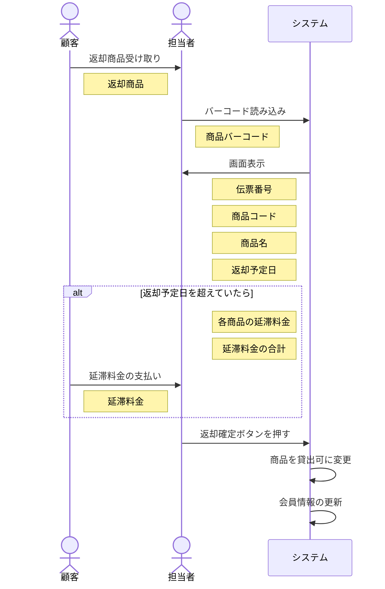

```mermaid
sequenceDiagram
    actor 顧客
    actor 担当者
    participant システム

    顧客 ->> 担当者: 返却商品受け取り
    note right of 顧客:返却商品
    担当者 ->> システム:　バーコード読み込み
    note right of 担当者:商品バーコード
    システム ->> 担当者:画面表示
    note left of システム:伝票番号
    note left of システム:商品コード
    note left of システム:商品名
    note left of システム:返却予定日
    alt  返却予定日を超えていたら
        note left of システム:各商品の延滞料金
        note left of システム:延滞料金の合計
        顧客 ->> 担当者:延滞料金の支払い
        note right of 顧客:延滞料金
    end
    担当者 ->> システム:返却確定ボタンを押す
    システム ->> システム:商品を貸出可に変更
    システム ->> システム:会員情報の更新
```